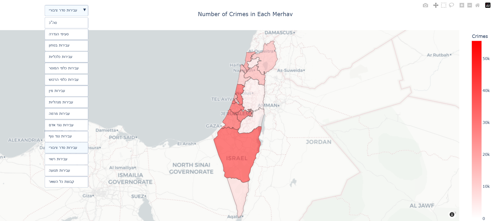

### Visualization Project - Israeli Police Data
#### Gilad Erez & May Hakim

##### Example: Crime Map by Merhav

  

The repository contains the code and outputs made as a part of the "Visualization" M.Sc course in IEM department in BGU.
The visualizations aim to present the data shared by the Israeli police in recent years and make it more accessible.

In order to view interative plots (HTML files) :
1. Click on file's name.
2. Download raw file.
3. Open file with browser.

In order to run the code:
1. Intall all the libraries imported in "main".
2. Unzip the two ZIP files and add to project directory.
3. Run the "main" script.

Enjoy!
